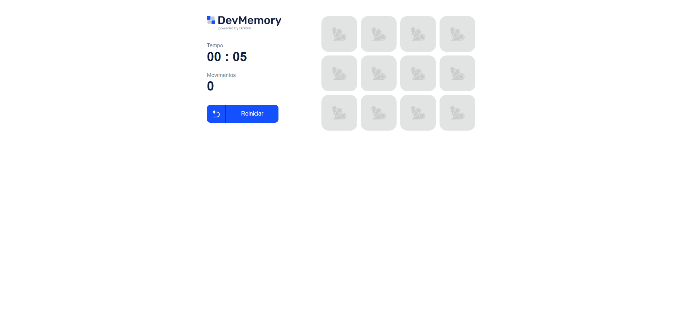

# 🎮 Jogo da Memória

Aplicação desenvolvida com **React, TypeScript, Tailwind CSS e Next.js**, que implementa um clássico jogo da memória.

O objetivo do jogo é encontrar todos os pares de cartas no menor número de tentativas possível.

Projeto desenvolvido durante o curso da B7web.

---

## 🚀 Deploy

Você pode acessar o projeto online aqui:  
👉 [Jodo da Mémoria](https://react-memorygame-magalb.vercel.app/)

---

## 📸 Preview



---

## 🛠️ Tecnologias utilizadas

- React
- TypeScript
- Tailwind CSS
- Next.js
- Vercel (deploy)

---

## 🚀 Como rodar o projeto

### 📦 Instalar dependências
```bash
npm install